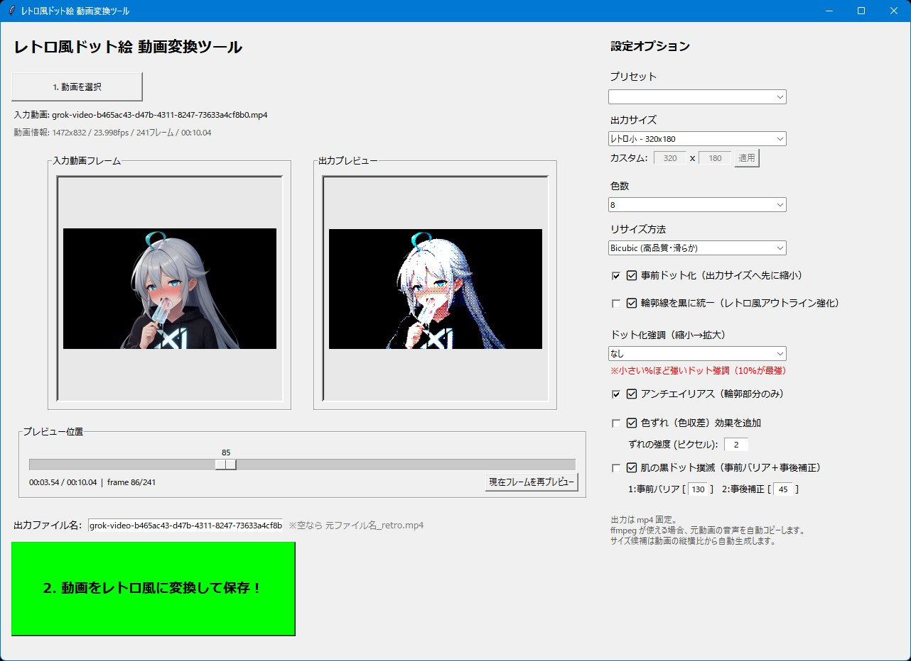

# レトロ風ドット絵 動画変換ツール

## 機能概要

MP4動画をレトロ風ドット絵（PC98/MSX風）に変換できる、プリセット豊富なTkinter製GUIツールです。
### 主な機能

- MP4などの動画をドラッグ＆ドロップで読み込み、シークバーで任意フレームをリアルタイムプレビュー
- 豊富なレトロ設定（PC98/PC88/MSX/MSX2プリセット、出力サイズ、色数、リサイズ方法、事前ドット化、輪郭線強化、アンチエイリアス、色ずれ、肌保護など）
- フレームごとにPIL＋KMeans＋Bayerディザリングでドット絵化処理
- 最終的にffmpegで音声付きMP4として出力（元動画の音声を保持）
- 進捗バー付きで長時間動画も安心

### 一言で言うと

「レトロ風ドット絵 動画変換ツール」

## FFmpegについて

このツールは内部でFFmpegを使用しています。
ツールと同じフォルダにffmpeg.exeを置いてください。

FFmpegの公式ダウンロード先

FFmpeg 公式サイト (Downloadページ): https://ffmpeg.org/download.html

## 使い方

1. **アプリを起動する**

    ターミナルで`python retro-dot-video-converter.py`を実行（事前に`pip install pillow numpy opencv-python tkinterdnd2 scikit-learn`を済ませておけよ）。

2. **動画を読み込む**

    「1. 動画を選択」ボタンか、ウィンドウにMP4などをドラッグ＆ドロップ。

3. **出力設定を行う**

    - プリセット（PC98、MSXなど）を選択
    - 出力サイズを選択（自動生成 or カスタム）
    - 色数、リサイズ方法、事前ドット化、輪郭強化、アンチエイリアス、色ずれ、肌保護などを好みでON/OFF・調整

4. **プレビューを確認**

    シークバーを動かして入力／出力のドット絵化具合をリアルタイムでチェック。

5. **変換を実行する**

    「2. 動画をレトロ風に変換して保存！」ボタンをクリック。進捗を見ながら待つと、元動画と同じフォルダに`_retro.mp4`が生成される。

## 必要環境

- Python 3.10以上
- 必要なライブラリはソースコードの先頭に書いてあります。

## ライセンス

**MIT License** で公開しています。  
ご自由に使って、改変して、参考にしてください。  
ただし**自作発言はNG**でお願いします。

This tool uses FFmpeg (https://ffmpeg.org/). FFmpeg is licensed under the LGPL/GPL. See https://www.ffmpeg.org/legal.html for details.
